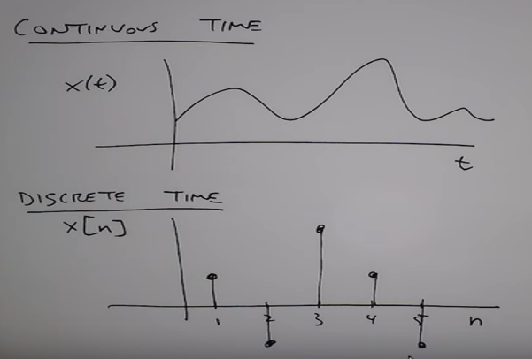
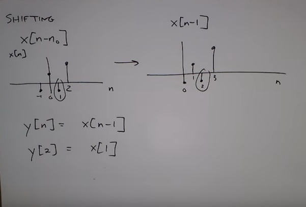

# DSP

DSP stand for Digital Signal Processing in Python 

I’ve been spending a fair amount of time lately learning Python, but most of my efforts have been focused on the turtle graphics module. It’s a lot of fun, and some of the images I’ve been able to come up with are quite interesting (to me, at least), but what I really want to do is learn how to do things with audio. So I’ve started studying DSP. I’m pretty confortable with continuous functions, but discrete functions can be a bit of a challenge at first - indexes, the meaning of frequency and time, etc. With a little practice - which is all this post is - it becomes clear pretty quickly. Along the way, I get some practice plotting with Matplotlib, Numpy and Scipy. First order of business, I want to understand sinusoid generation. The basic equation is:

[http://www.mrcolson.com/2015/12/24/Making-Sinusoids-with-Python.html](http://www.mrcolson.com/2015/12/24/Making-Sinusoids-with-Python.html)

### Digital representation of sound

Analog digital converter (ADC) receives the discrete voltages from the sample and hold device, and ascribes a numerical value to each amplitude. This process of converting voltages to numbers is known as quantization. Those numbers are expressed in the computer as a string of binary digits (1 or 0). To play the sound back, we read the numbers from memory, and deliver those numbers to a digital-to-analog converter (DAC) at the same rate at which they were recorded. The DAC converts each number to a voltage, and communicates those voltages to an amplifier to increase the amplitude of the voltage.

In order for a computer to represent sound accurately, many samples must be taken per second— many more than are necessary for filming a visual image. In fact, we need to take more than twice as many samples as the highest frequency we wish to record. (For an explanation of why this is so, see Limitations of Digital Audio on the next page.) If we want to record frequencies as high as 20,000 Hz, we need to sample the sound at least 40,000 times per second. The standard for compact disc recordings (and for ‘CD-quality’ computer audio) is to take 44,100 samples per second for each channel of audio. The number of samples taken per second is known as the sampling rate.

This means the computer can only accurately represent frequencies up to half the sampling rate. Any frequencies in the sound that exceed half the sampling rate must be filtered out before the sampling process takes place. This is accomplished by sending the electrical signal through a low-pass filter which removes any frequencies above a certain threshold. Also, when the digital signal (the stream of binary digits representing the quantized samples) is sent to the DAC to be re-converted into a continuous electrical signal, the sound coming out of the DAC will contain spurious high frequencies that were created by the sample and hold process itself. (These are due to the ‘sharp edges’ created by the discrete samples, as seen in the above example.) Therefore, we need to send the output signal through a low-pass filter, as well.

[https://docs.cycling74.com/max5/tutorials/msp-tut/mspdigitalaudio.html](https://docs.cycling74.com/max5/tutorials/msp-tut/mspdigitalaudio.html)

---

### Analog-vs-digital

[https://learn.sparkfun.com/tutorials/analog-vs-digital](https://learn.sparkfun.com/tutorials/analog-vs-digital)

---

### Binary

[https://learn.sparkfun.com/tutorials/binary](https://learn.sparkfun.com/tutorials/binary)

---

### How is audio represented with numbers?

I like thinking about how everything can be and is represented by numbers. For example, plaintext is represented by a code like ASCII, and images are represented by RGB values. These are the simplest ways to represent text and images.

What is the simplest way that audio can be represented with numbers? I want to learn how to write programs that work with audio and thought this would be a good way to start. I can't seem to find any good explanations on the internet, though.

Audio can represented by digital samples. Essentially, a sampler (also called an Analog to digital converter) grabs a value of an audio signal every 1/fs, where fs is the sampling frequency. The ADC, then quantizes the signal, which is a rounding operation. So if your signal ranges from 0 to 3 Volts (Full Scale Range) then a sample will be rounded to, for example a 16-bit number. In this example, a 16-bit number is recorded once every 1/fs/

[https://stackoverflow.com/questions/732699/how-is-audio-represented-with-numbers](https://stackoverflow.com/questions/732699/how-is-audio-represented-with-numbers)

---

### Arrays

[https://processing.org/tutorials/arrays/](https://processing.org/tutorials/arrays/)

---

### Numpy

NumPy’s main object is the homogeneous multidimensional array. It is a table of elements (usually numbers), all of the same type, indexed by a [tuple](https://www.tutorialspoint.com/python/python_tuples.htm) of positive integers. In NumPy dimensions are called axes. The number of axes is rank.

For example, the coordinates of a point in 3D space [1, 2, 1] is an array of rank 1, because it has one axis. That axis has a length of 3. In the example pictured below, the array has rank 2 (it is 2-dimensional). The first dimension (axis) has a length of 2, the second dimension has a length of 3.

    [[ 1., 0., 0.], # first dimension (axis) has a length of 2
     [ 0., 1., 2.]] # second dimension (axis) has a length of 3

    >>> d = np.array( [ [1,0,0], [0,1,2] ], dtype=float )
    >>> d.shape
    (2, 3)

---

#### Array Creation

    >>> import numpy as np
    >>> a = np.arange(15)
    # array([ 0,  1,  2,  3,  4,  5,  6,  7,  8,  9, 10, 11, 12, 13, 14])

##### arange

To create sequences of numbers, NumPy provides a function analogous to range that returns arrays instead of lists.

    >>> np.arange( 10, 30, 5 ) # where 10 is starting number, 30 is the end number and 5 are the steps
    array([10, 15, 20, 25]) so you get 10(+5)15(+5)20(+5)25 
    >>> np.arange( 0, 2, 0.3 )                 # it accepts float arguments
    array([ 0. ,  0.3,  0.6,  0.9,  1.2,  1.5,  1.8])

##### reshape

    # reshape in (n) 3 rows and (m) 5 columns
    >>> a.reshape(3,5)
    # array([[ 0,  1,  2,  3,  4],
    #        [ 5,  6,  7,  8,  9],
    #        [10, 11, 12, 13, 14]])

[https://docs.scipy.org/doc/numpy-1.12.0/user/quickstart.html](https://docs.scipy.org/doc/numpy-1.12.0/user/quickstart.html)

#### Array objects

[https://docs.scipy.org/doc/numpy-1.14.0/reference/arrays.html](https://docs.scipy.org/doc/numpy-1.14.0/reference/arrays.html)

---

#### How Is Digital Audio Is Created From Sound Waves

[How Is Digital Audio Is Created From Sound Waves?](https://www.youtube.com/watch?v=L06xKB6l7Ao)

---

### Questions:

     >>> d = np.array( [ [1,0,0], [0,1,2] ], dtype=float )
     >>> d.shape
     (2, 3)
     # Why the first dimension a lenght of 2 and second dimension a lenght of 3 

---

 

---

## A1: Python and sounds

---

### A1-Part-1: Reading a wav audio file

Complete the function readAudio(inputFile) in the file A1Part1.py so that it
reads an audio file and returns 10 consecutive samples of the file starting from
the 50001th sample. This means that the output should exactly contain the
50001th sample to the 50010th sample (10 samples).
The input to the function is the file name (including the path) and the output
should be a numpy array containing 10 samples.

If you use the wavread function from the utilFunctions module the input
samples will be automatically converted to floating point numbers with a range
from -1 to 1, which is what we want.
Remember that in python, the index of the first sample of an array is 0 and
not 1.

If you run your code using piano.wav as the input, the function should return
the following numpy array with 10 samples: array([-0.06213569, -0.04541154, -
0.02734458, -0.0093997 , 0.00769066, 0.02319407, 0.03503525, 0.04309214, 0.04626606,
0.0441908], dtype=float32).

    def readAudio(inputFile):
    """
    Input:
    inputFile: the path to the wav file
    Output:
    The function should return a numpy array that
    contains 10 samples of the audio.
    """
    ## Your code here

---
    #A1-Part-1.py

    import numpy as np
    from scipy.io.wavfile import read
    import sys
    sys.path.append('software/models')

    import utilFunctions as UF

    def readAudio(inputFile='../../sounds/piano.wav'):
        print("Input File: ", inputFile)
        (fs, x) = UF.wavread(inputFile)	
        # The function should return a numpy array that contains 10 samples of the audio.
        y = x[50000:50010]
        print(y, "dtype=", y.dtype)
        print("SampleRate :", fs)

---

    $ python3 A1-Part-1.py 
    Input File:  ../../sounds/piano.wav
    [-0.06213569 -0.04541154 -0.02734458 -0.0093997   0.00769066  0.02319407
      0.03503525  0.04309214  0.04626606  0.0441908 ] dtype= float32
    SampleRate : 44100

---

 

---

### A1-Part-2: Basic operations with audio

Complete the function minMaxAudio(inputFile) in the file A1Part2.py so that
it reads an audio file and returns the minimum and the maximum values of the
audio samples in that file.

The input to the function is the wav file name (including the path) and the
output should be two floating point values returned as a tuple.
If you run your code using oboe-A4.wav as the input, the function should
return the following output: (-0.83486432, 0.56501967)
def minMaxAudio(inputFile):

    """
    Input:
    inputFile: file path to the wav file
    Output:
    A tuple of the minimum and the maximum value of the audio
    samples, like: (min_val, max_val)
    """
    ## Your code here

---

    # A1-Part-2.py
    """! PYTHON 3 !"""

    import numpy as np
    from scipy.io.wavfile import read
    import sys
    sys.path.append('software/models')

    import utilFunctions as UF

    def minMaxAudio(inputFile='../../sounds/oboe-A4.wav'):
        # Input: inputFile: file path to the wav file Output: 
        print("Input File: ", inputFile)
        (fs, x) = UF.wavread(inputFile)
        min_val = np.min(x)
        max_val = np.max(x)	
        # Output: A tuple of the minimum and the maximum value of the audio samples, like: (min_val, max_val)
        print( "min_val max val:", min_val, max_val)

    print(readAudio())
    print(minMaxAudio())

---

    $ python3 A1-Part-2.py 
    Input File:  ../../sounds/oboe-A4.wav
    min_val: -0.834864
    max val: 0.56502

---

 

---

### A1-Part-3: Python array indexing (4 points)

Complete the function hopSamples(x,M) in the file A1Part3.py so that given a
numpy array x, the function returns every Mth element in x, starting from the
first element.

The input arguments to this function are a numpy array x and a positive
integer M such that M is less than the number of elements in x. The output of
this function should be a numpy array.

If you run your code with x = np.arange(10) and M = 2, the function should
return the following output: array([0, 2, 4, 6, 8]).
def hopSamples(x,M):

    """
    Inputs:
    x: input numpy array
    M: hop size (positive integer)

    Output:
    A numpy array containing every Mth element in x, starting
    from the first element in x.
    """
    ## Your code here

---

The basic slice syntax is i:j:k where i is the starting index, j is the stopping index, and k is the step (k\neq0). This selects the m elements (in the corresponding dimension) with index values i, i + k, ..., i + (m - 1) k where m = q + (r\neq0) and q and r are the quotient and remainder obtained by dividing j - i by k: j - i = q k + r, so that i + (m - 1) k < j.

    Example

    >>> x = np.array([0, 1, 2, 3, 4, 5, 6, 7, 8, 9])
    >>> x[1:7:2]
    array([1, 3, 5])

[https://docs.scipy.org/doc/numpy-1.14.0/reference/arrays.indexing.html](https://docs.scipy.org/doc/numpy-1.14.0/reference/arrays.indexing.html)

---

    # A1-Part-3.py
    """! PYTHON 3 !"""

    import numpy as np
    import sys

    def hopSamples(x,M):
        a = np.arange(0,x,M)
        print(a)
        # array([0, 2, 4, 6, 8])

    print(hopSamples(10,2))

---

    $ python3 A1-Part-3.py 
    [0 2 4 6 8]

---

 

---

### A1-Part-4: Downsampling audio - Changing the

sampling rate (Optional )
One of the required processes to represent a signal inside a computer is sam-
pling. The sampling rate is the number of samples obtained in one second when
sampling a continuous analog signal to a discrete digital signal. As mentioned
earlier, most of the time we will be working with wav audio files that have a
sampling rate of 44100 Hz, which is a typical value. For some applications,
changing the sampling rate of an audio signal can be necessary. This optional
part shows how to do this, from a higher sampling rate to a lower one.

Complete the function downsampleAudio(inputFile,M) in the file A1Part4.py
so that given an audio file, it applies downsampling by a factor of M and create
a wav audio file <input_name>_downsampled.wav at a lower sampling rate.
In Part1 you learned how to read a wav file and the function from Part3
can be used to perform the downsampling of a signal contained in an array. To
create a wav audio file from an array, you can use the wavwrite function from
the utilFunctions module. Be careful with the sampling rate parameter since it
should be different from that of the original audio.

You can test your code using the file ‘vibraphone-C6.wav’ and a down-
sampling factor of M=16. Listen to the ‘vibraphone-C6_downsampled.wav’
sound. What happened to the signal? How could we avoid damaging the sig-
nal when downsampling it? You can find some related information in https:
//en.wikipedia.org/wiki/Decimation_%28signal_processing%29.

    def downsampleAudio(inputFile, M):
    3"""
    Inputs:
    inputFile: file name of the wav file (including path)
    M: downsampling factor (positive integer)
    """
    ## Your code here

---

#### How down-sampling a array

    import numpy as np
    a = np.arange(1,11,1)
    print(a)
    print(a[::3])

    # The last line is equivalent to:
    print(a[0:a.size:3])

    # with the slicing notation as start:stop:step

    # Result:

    [ 1 2 3 4 5 6 7 8 9 10]

    [ 1 4 7 10]

[https://stackoverflow.com/questions/34231244/downsampling-a-2d-numpy-array-in-python](https://stackoverflow.com/questions/34231244/downsampling-a-2d-numpy-array-in-python)

---

#### TypeError: only length-1 arrays can be converted to Python scalars

    (fs, x) = UF.wavread(inputFile)
    x_array = np.array(x)
    print(a_array)

    # TypeError: only length-1 arrays can be converted to Python scalars
 
When you feed a native python list like [1,2,3] to a numpy method that expects a numpy array, you will get this error. That numpy method takes your native python list, and tries to digest it, and way deep down it pukes up this response. A more user friendly error message would have been: TypeError: Don't feed native python lists into numpy functions that expect numpy arrays. Either convert your python list to a numpy array or package your python lists into a tuple. Python numpy really dropped the ball on that one, that error message is terrible.

[https://stackoverflow.com/questions/21687581/typeerror-only-length-1-arrays-can-be-converted-to-python-scalars-while-trying](https://stackoverflow.com/questions/21687581/typeerror-only-length-1-arrays-can-be-converted-to-python-scalars-while-trying)
	

    (fs, x) = UF.wavread(inputFile)
    x.astype(int)
    x_array = np.array(x)
    print(x_array)

---

    # A1-Part-4.py

    import sys, os
    import numpy as np
    import utilFunctions as UF

    def downsampleAudio(inputFile,M):
       (fs, x) = UF.wavread(inputFile)
       x.astype(int)
       x_array = np.array(x)
       x_array_slice = x_array[::M] # equivalent to: x_array_slice[0:x_array.size:M]

       outputFile_name =   'downsampled_' + inputFile[13:]
       outputFile_path = '../../sounds/output_sounds/'
       name_and_path = outputFile_path + outputFile_name

       UF.wavwrite(x_array_slice, fs, name_and_path )

    downsampleAudio('../../sounds/vibraphone-C6.wav', 16)

---

 

---

## A2: Sinusoids and DFT

---

### A2_Part-1: Generate a sinusoid

Complete the function genSine(A, f, phi, fs, t) in the file A2Part1.py to
generate a real sinusoid (use np.cos()) given its amplitude A, frequency f (Hz),
initial phase phi (radians), sampling rate fs (Hz) and duration t (seconds).

All the input arguments to this function (A, f, phi, fs and t) are real numbers
such that A, t and fs are positive, and fs > 2*f to avoid aliasing. The function
should return a numpy array x of the sinusoid generated using Equation 1.
if you run your code using A=1.0, f = 10.0, phi = 1.0, fs = 50.0 and t =
0.1, the output x should be the following numpy array: array([ 0.54030231,
-0.63332387, -0.93171798, 0.05749049, 0.96724906])

    def genSine(A, f, phi, fs, t):
    """
    Inputs:
    A (float) = amplitude of the sinusoid
    f (float) = frequency of the sinusoid in Hz
    phi (float) = initial phase of the sinusoid in radians
    fs (float) = sampling frequency of the sinusoid in Hz
    t (float) = duration of the sinusoid (is second)
    Output:
    The function should return a numpy array
    x (numpy array) = The generated sinusoid (use np.cos())
    """
    ## Your code here

---

#### Sinus, cosinus en tangens

[http://wm.math4allview.appspot.com/view?comp=lj3-h-h24&subcomp=lj3-h-h24-04&variant=basis_wm](http://wm.math4allview.appspot.com/view?comp=lj3-h-h24&subcomp=lj3-h-h24-04&variant=basis_wm)

---

    Code #1 : Working
    # Python program explaining
    # cos() function
     
    import numpy as np
    import math
     
    in_array = [0, math.pi / 2, np.pi / 3, np.pi]
    print ("Input array : \n", in_array)
     
    cos_Values = np.cos(in_array)
    print ("\nCosine values : \n", cos_Values)

[https://www.geeksforgeeks.org/numpy-cos-python/](https://www.geeksforgeeks.org/numpy-cos-python/)

---

#### Making Sinusoids with Python

[http://www.mrcolson.com/2015/12/24/Making-Sinusoids-with-Python.html](http://www.mrcolson.com/2015/12/24/Making-Sinusoids-with-Python.html)

---
    # A2_Part-1.py

    def genCos(A, f, phi, fs, t):

        T = t/fs  
        samples = 100
        n = np.arange(samples)
        x = A*np.cos(2*np.pi*f*n*T + phi)
        x_slice = x[:45:10]
        print('x :', x_slice)
        # [ 0.54030231, -0.63332387, -0.93171798, 0.05749049, 0.96724906]

    A=1.0     # A (float) = amplitude of the sinusoid
    f=10.0    # f (float) = frequency of the sinusoid in Hz
    phi=1.0   # phi (float) = initial phase of the sinusoid in radians
    fs=50.0   # fs (float) = sampling frequency of the sinusoid in Hz
    t=0.1     # t (float) = duration of the sinusoid (is second)
        
    genCos(A, f, phi, fs, t)

---

#### Signals

* Continnous time signal (analog signal)
* Discrete time signal   (digital signal)

 

[DSP Lecture 1: Signals](https://www.youtube.com/watch?v=hVOA8VtKLgk)

---

### A2_Part-2: Generate a complex sinusoid

---

### A2_Part-3: Implement the discrete Fourier transform(DFT)

---

### A2_Part-4: Implement the inverse discrete Fourier transform (IDFT)

---

### A2_Part-5: Compute the magnitude spectrum

---

 

---

### Links

[http://essentia.upf.edu/documentation/index.html](http://essentia.upf.edu/documentation/index.html)

[https://github.com/cirosantilli/cpp-cheat](https://github.com/cirosantilli/cpp-cheat)

[http://www.cirosantilli.com/](http://www.cirosantilli.com/)

[https://stackoverflow.com/questions/732699/how-is-audio-represented-with-numbers](https://stackoverflow.com/questions/732699/how-is-audio-represented-with-numbers)

[https://processing.org/tutorials/arrays/](https://processing.org/tutorials/arrays/)

[DSP Lecture 1: Signals](https://www.youtube.com/watch?v=hVOA8VtKLgk)

[DSP Lecture 2: Linear, time-invariant systems](https://www.youtube.com/watch?v=yIYcT7U2OaA)

[DSP Lecture 3: Convolution and its properties](https://www.youtube.com/watch?v=kVSUnbgul7g)

[DSP Lecture 4: The Fourier Series](https://www.youtube.com/watch?v=0J4IAEUW5pA)

[DSP Lecture 5: the Fourier Transform](https://www.youtube.com/watch?v=5HSn3DPHQcQ)

[DSP Lecture 6: Frequency Response](https://www.youtube.com/watch?v=QqDbYI4YcfM)

---

 

---

### Github

    git init
    git add .
    git commit -m "25 commit"
    git remote add origin https://github.com/Crojav/DSP.git
    git push origin master

    git config --global credential.helper cache
    # Set git to use the credential memory cache

    # To change the default password cache timeout, enter the following:

    git config --global credential.helper 'cache --timeout=3600'
    # Set the cache to timeout after 1 hour (setting is in seconds)

